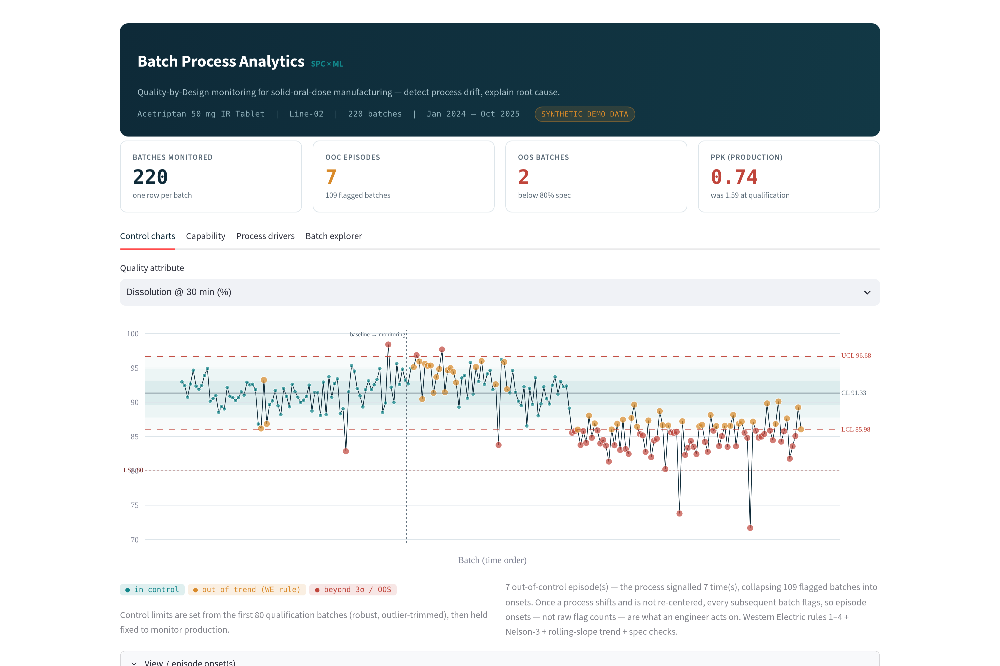
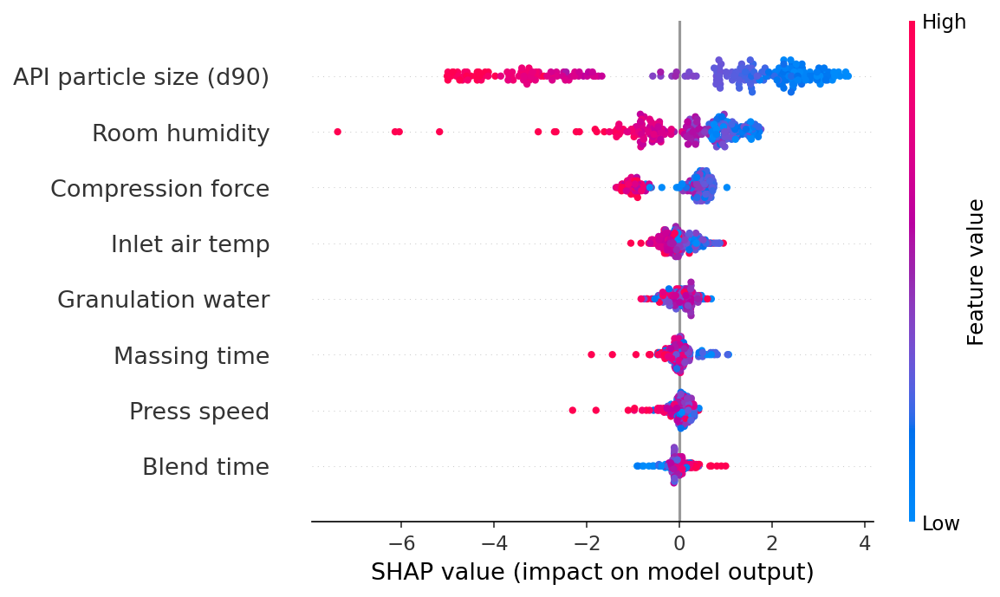

# Batch Process Analytics — SPC × ML for Pharmaceutical Manufacturing

**Live demo:** *(add your Streamlit Cloud URL here after deployment)*

A Quality-by-Design (QbD) analytics system for solid-oral-dose batch manufacturing
that answers the two questions every process team asks:

> **When did the process go out of control — and why?**

It combines a validated Statistical Process Control (SPC) engine (detects *when*)
with an explainable XGBoost model (explains *why*), wrapped in an interactive
Streamlit dashboard.



---

## Headline results

The system was validated against synthetic manufacturing data containing
**6 deliberately planted process events** with known ground truth:

| # | Planted event | Mechanism | Detected? | How |
|---|---|---|---|---|
| 1 | Tooling-wear drift (batch 90→) | Compression force ↑ → hardness ↑ | ✅ | WE Rule 4 *and* rolling-slope rule, one batch apart (corroboration) |
| 2 | API lot change (batch 140) | Coarser d90 → dissolution ↓ | ✅ | WE Rules 2/3 — flagged at the *first* shifted batch |
| 3–6 | 4 humidity excursions | RH spike → dissolution failure | ✅ 4/4 | WE Rule 1 (beyond 3σ); 2 also OOS |

**Detection rate: 6/6 (100%)** — see [`validate_spc.py`](validate_spc.py) for the reproducible check.

Because a process that shifts and is not re-centered flags *every* subsequent
batch, raw flag counts overstate how many times the process actually signalled.
The engine therefore collapses consecutive violations into **out-of-control
episodes** — each with an onset (what an engineer acts on), a span, and a peak
severity — so the dashboard reports a handful of episode onsets rather than a
wall of ~100 flagged batches. Detection is scored on whether each planted event
carries a signal; episodes are how that signal is summarised for action.

The capability analysis tells the process story through the **Ppk collapse and
the widening Cpk–Ppk gap**:

| Dissolution capability | Qualification | Full production |
|---|---|---|
| Cpk (within-σ) | 2.12 | 1.75 |
| **Ppk (overall-σ)** | **1.59** (capable) | **0.74** (not capable) |
| Cpk – Ppk gap | 0.53 | 1.01 |

Within-batch (short-term) variation stays tight, but the sustained mean shift
from the API lot change nearly doubles the *overall* σ — so Ppk collapses while
Cpk only dips. The **widening Cpk–Ppk gap is the textbook signature** of a
process that is capable short-term but unstable over time: exactly what the
planted drift and lot change created, and what the SPC engine caught. Note that
Cpk falls too (2.12 → 1.75), not just Ppk — because the mean drifts *toward* the
lower spec limit. It is a mean shift, not merely added variance, so the "Cpk
holds constant while Ppk collapses" idealisation doesn't quite apply here; the
honest signal is the gap.

The ML layer is an **explanatory model** — its job is to rank *which* process
parameters drive dissolution, not to forecast future batches. Given **only
process parameters and no knowledge of the planted events**, it recovers all
three root-cause mechanisms as its top drivers, with physically correct
directionality:



| Rank | Driver | Direction | Maps to planted event |
|---|---|---|---|
| 1 | API particle size (d90) | coarser → lower dissolution | API lot change |
| 2 | Room humidity | higher → lower dissolution | Humidity excursions |
| 3 | Compression force | higher → lower dissolution | Tooling-wear drift |

The third row is the subtle one: tablet **hardness** is deliberately *excluded*
from the feature set (it is itself a CQA, not a knob you turn). Dissolution
genuinely depends on hardness — so the model surfaces **compression force**, the
CPP that *drives* hardness, as the actionable upstream proxy. It found the knob,
not just the correlate. Recovering these directions is not a discovery (the
generator's dissolution equation is linear in d90, hardness and humidity by
construction) — it is a **validation that the SHAP attribution pipeline is
trustworthy** on a case where the answer is known.

**Performance — reported two honest ways:**

| Validation scheme | R² | What it measures |
|---|---|---|
| Random 80/20 split | **0.72** (CV 0.718 ± 0.028, RMSE 2.6%) | Explanatory fit across both API-lot regimes — the right scheme for driver attribution |
| Time-ordered (train first 80%, predict last 20%) | **0.24** | Forecasting the *next* batches — deliberately reported because it's much lower |

The gap between them is itself informative: within a single production regime
the dominant driver (API d90) is nearly constant, so once you condition on the
current lot there is far less *predictable* batch-to-batch variation left. The
random-split number is not overfit (5-fold CV agrees to ±0.03); it is simply
answering the attribution question, not the forecasting one — and this project
is explicit about which is which.

---

## Why synthetic data?

Real batch manufacturing data is proprietary and GMP-protected — no responsible
scientist puts it on GitHub. Instead, this project simulates a wet-granulation →
compression tablet process where the CQAs are *genuine functions* of the CPPs
(dissolution truly depends on particle size, hardness, and humidity), plus
realistic noise, seasonality, and planted special-cause events.

This is a feature, not a compromise: **because the ground truth is known, the
detection system can be validated** — something rarely possible with real data.

## Architecture

```
generate_batch_data.py   Synthetic GMP batch data w/ planted events (ground truth)
        │
        ▼
spc_engine.py            I-MR charts · robust Phase-I baseline · Western Electric
        │                rules 1–4 · Nelson-3 + rolling-slope trend · Cpk/Ppk
        ├──▶ validate_spc.py    Proves 6/6 event detection vs ground truth
        ▼
ml_drivers.py            XGBoost CQA model · SHAP driver ranking + direction
        │
        ▼
app.py                   Streamlit dashboard (Plotly): control charts,
                         capability, drivers, batch explorer
```

**Methodology notes**

- Control limits are established from an 80-batch *qualification baseline*
  with iterative outlier trimming, then held fixed for production monitoring —
  computing limits from data that already contains special-cause variation
  inflates them and masks the very events you need to catch (Phase I / Phase II
  SPC discipline, per Montgomery).
- σ within is estimated as MR̄/d₂ (I-MR, n=2); capability reports both
  Cpk (within) and Ppk (overall) because the *gap* between them is diagnostic.
- Detection uses Western Electric rules 1–4, two trend rules, and spec checks.
  A slow drift whose per-batch step is well below the common-cause σ (the planted
  tooling wear, ~1/20 σ/batch) is caught **two independent ways**: **WE Rule 4**
  (8 points one side of the centerline — runs-based) and a **rolling-slope rule**
  (a significant OLS slope over a 24-batch window — regression-based, |t| > 3).
  The planted drift trips both within a batch of each other (WE4 at B24-1108,
  slope at B24-1109), which is exactly the kind of corroboration you want. A
  strictly-monotonic rule cannot see this drift — the per-step signal is too
  small — so **Nelson Rule 3** is included only for genuine monotonic trends and
  is not oversold as the drift detector. Consecutive violations are collapsed
  into **out-of-control episodes** (onset + span + peak severity) so a sustained
  shift reads as one event with an onset, not a wall of individually-flagged
  batches.
- The ML feature set includes only CPPs, raw-material and environmental
  inputs — no other CQAs — so importances map to actionable process knobs.
- Framing follows ICH Q8 (QbD), Q9 (quality risk management), and Q10
  (pharmaceutical quality system): identify CQAs, link them to CPPs, monitor,
  and improve.
- **Deliberate simplifications** (kept simple on purpose, called out for
  honesty): dissolution is treated as a single "NLT 80% at 30 min" limit rather
  than the staged USP S1/S2/S3 acceptance, and content uniformity as a plain
  %RSD limit rather than the USP <905> Acceptance Value. The SPC/ML methods are
  the point; the acceptance arithmetic would slot in without changing them.

## Run it

```bash
pip install -r requirements.txt
python generate_batch_data.py   # regenerate data (seeded, reproducible)
python validate_spc.py          # verify 6/6 event detection
python ml_drivers.py            # train model, produce SHAP report + figures
streamlit run app.py            # launch dashboard
```

## Repository contents

| File | Purpose |
|---|---|
| `generate_batch_data.py` | Seeded synthetic data generator (220 batches, 8 CPPs, 5 CQAs, 6 planted events) |
| `spc_engine.py` | Reusable SPC library (charts, rules, capability) |
| `validate_spc.py` | Ground-truth validation harness |
| `ml_drivers.py` | XGBoost + SHAP process-driver analysis |
| `app.py` | Streamlit dashboard |
| `batch_data.csv`, `ground_truth.csv` | Pre-generated data + event log |

## About

Built by a solid-state pharmaceutical scientist (13 y pharma R&D — crystallization,
polymorph science, co-crystal screening) moving deeper into CMC data science.
This project reflects how process monitoring is actually practiced in
development and manufacturing — the statistics, the vocabulary, and the
regulatory framing — implemented end-to-end in Python.

*All data is synthetic. No proprietary or GMP data was used.*
